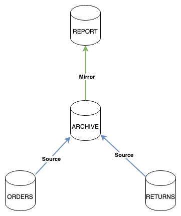
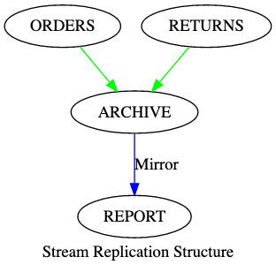

## Data Replication

Replication allows you to move data between streams in either a 1:1 mirror style or by multiplexing multiple source streams into a new stream.  In future builds this will allow data to be replicated between accounts as well, ideal for sending data from a Leafnode into a central store.



Here we have 2 main streams - _ORDERS_ and _RETURNS_ - these streams are clustered across 3 nodes. These Streams have short retention periods and are memory based.

We create a _ARCHIVE_ stream that has 2 _sources_ set, the _ARCHIVE_ will pull data from the sources into itself.  This stream has a very long retention period and is file based and replicated across 3 nodes.  Additional messages can be added to the ARCHIVE by sending to it directly.

Finally, we create a _REPORT_ stream mirrored from _ARCHIVE_ that is not clustered and retains data for a month.  The _REPORT_ Stream does not listen for any incoming messages, it can only consume data from _ARCHIVE_.

### Mirrors

A *mirror* copies data from 1 other stream, as far as possible IDs and ordering will match exactly the source. A *mirror* does not listen on a subject for any data to be added. The Start Sequence and Start Time can be set, but no subject filter. A stream can only have 1 *mirror* and if it is a mirror it cannot also have any *source*.

### Sources

A *source* is a stream where data is copied from, one stream can have multiple sources and will read data in from them all. The stream will also listen for messages on it's own subject. We can therefore not maintain absolute ordering, but data from 1 single source will be in the correct order but mixed in with other streams. You might also find the timestamps of streams can be older and newer mixed in together as a result.

A Stream with sources may also listen on subjects, but could have no listening subject.  When using the `nats` CLI to create sourced streams use `--subjects` to supply subjects to listen on.

A source can have Start Time or Start Sequence and can filter by a subject. 

### Configuration

The ORDERS and RETURNS streams as normal, I will not show how to create them.

```nohighlight
$ nats s report
Obtaining Stream stats

+---------+---------+----------+-----------+----------+-------+------+---------+----------------------+
| Stream  | Storage | Template | Consumers | Messages | Bytes | Lost | Deleted | Cluster              |
+---------+---------+----------+-----------+----------+-------+------+---------+----------------------+
| ORDERS  | Memory  |          | 0         | 0        | 0 B   | 0    | 0       | n1-c2, n2-c2*, n3-c2 |
| RETURNS | Memory  |          | 0         | 0        | 0 B   | 0    | 0       | n1-c2*, n2-c2, n3-c2 |
+---------+---------+----------+-----------+----------+-------+------+---------+----------------------+
```

We now add the ARCHIVE:

```nohighlight
$ nats s add ARCHIVE --source ORDERS --source RETURNS
? Storage backend file
? Retention Policy Limits
? Discard Policy Old
? Message count limit -1
? Message size limit -1
? Maximum message age limit -1
? Maximum individual message size -1
? Duplicate tracking time window 2m
? Number of replicas to store 3
? ORDERS Source Start Sequence 0
? ORDERS Source UTC Time Stamp (YYYY:MM:DD HH:MM:SS)
? ORDERS Source Filter source by subject
? RETURNS Source Start Sequence 0
? RETURNS Source UTC Time Stamp (YYYY:MM:DD HH:MM:SS)
? RETURNS Source Filter source by subject
```

And we add the REPORT:

```nohighlight
$ nats s add REPORT --mirror ARCHIVE
? Storage backend file
? Retention Policy Limits
? Discard Policy Old
? Message count limit -1
? Message size limit -1
? Maximum message age limit 1M
? Maximum individual message size -1
? Duplicate tracking time window 2m
? Number of replicas to store 1
? Mirror Start Sequence 0
? Mirror Start Time (YYYY:MM:DD HH:MM:SS)
? Mirror subject filter
```

When configured we'll see some additional information in a `nats stream info` output:

```nohighlight
$ nats stream info ARCHIVE
...
Source Information:

          Stream Name: ORDERS
                  Lag: 0
            Last Seen: 2m23s

          Stream Name: RETURNS
                  Lag: 0
            Last Seen: 2m15s
...

$ nats stream info REPORT
...
Mirror Information:

          Stream Name: ARCHIVE
                  Lag: 0
            Last Seen: 2m35s
...
```

Here the `Lag` is how far behind we were reported as being last time we saw a message.

We can confirm all our setup using a `nats stream report`:

```nohighlight
$ nats s report
+-------------------------------------------------------------------------------------------------------------------+
|                                                   Stream Report                                                   |
+---------+---------+----------+-------------+-----------+----------+-------+------+---------+----------------------+
| Stream  | Storage | Template | Replication | Consumers | Messages | Bytes | Lost | Deleted | Cluster              |
+---------+---------+----------+-------------+-----------+----------+-------+------+---------+----------------------+
| ARCHIVE | File    |          | Sourced     | 1         | 0        | 0 B   | 0    | 0       | n1-c2*, n2-c2, n3-c2 |
| ORDERS  | Memory  |          |             | 1         | 0        | 0 B   | 0    | 0       | n1-c2, n2-c2*, n3-c2 |
| REPORT  | File    |          | Mirror      | 0         | 0        | 0 B   | 0    | 0       | n1-c2*               |
| RETURNS | Memory  |          |             | 1         | 0        | 0 B   | 0    | 0       | n1-c2, n2-c2, n3-c2* |
+---------+---------+----------+-------------+-----------+----------+-------+------+---------+----------------------+

+---------------------------------------------------------+
|                   Replication Report                    |
+---------+--------+---------------+--------+-----+-------+
| Stream  | Kind   | Source Stream | Active | Lag | Error |
+---------+--------+---------------+--------+-----+-------+
| ARCHIVE | Source | ORDERS        | never  | 0   |       |
| ARCHIVE | Source | RETURNS       | never  | 0   |       |
| REPORT  | Mirror | ARCHIVE       | never  | 0   |       |
+---------+--------+---------------+--------+-----+-------+
```

We then create some data in both ORDERS and RETURNS:

```nohighlight
$ nats req ORDERS.new "ORDER {{Count}}" --count 100
$ nats req RETURNS.new "RETURN {{Count}}" --count 100
```

We can now see from a Stream Report that the data has been replicated:

```nohighlight
$ nats s report --dot replication.dot
Obtaining Stream stats

+---------+---------+----------+-----------+----------+---------+------+---------+----------------------+
| Stream  | Storage | Template | Consumers | Messages | Bytes   | Lost | Deleted | Cluster              |
+---------+---------+----------+-----------+----------+---------+------+---------+----------------------+
| ORDERS  | Memory  |          | 1         | 100      | 3.3 KiB | 0    | 0       | n1-c2, n2-c2*, n3-c2 |
| RETURNS | Memory  |          | 1         | 100      | 3.5 KiB | 0    | 0       | n1-c2*, n2-c2, n3-c2 |
| ARCHIVE | File    |          | 1         | 200      | 27 KiB  | 0    | 0       | n1-c2, n2-c2, n3-c2* |
| REPORT  | File    |          | 0         | 200      | 27 KiB  | 0    | 0       | n1-c2*               |
+---------+---------+----------+-----------+----------+---------+------+---------+----------------------+

+---------------------------------------------------------+
|                   Replication Report                    |
+---------+--------+---------------+--------+-----+-------+
| Stream  | Kind   | Source Stream | Active | Lag | Error |
+---------+--------+---------------+--------+-----+-------+
| ARCHIVE | Source | ORDERS        | 14.48s | 0   |       |
| ARCHIVE | Source | RETURNS       | 9.83s  | 0   |       |
| REPORT  | Mirror | ARCHIVE       | 9.82s  | 0   |       |
+---------+--------+---------------+--------+-----+-------+
```

Here we also pass the `--dot replication.dot` argument that writes a GraphViz format map of the replication setup.


